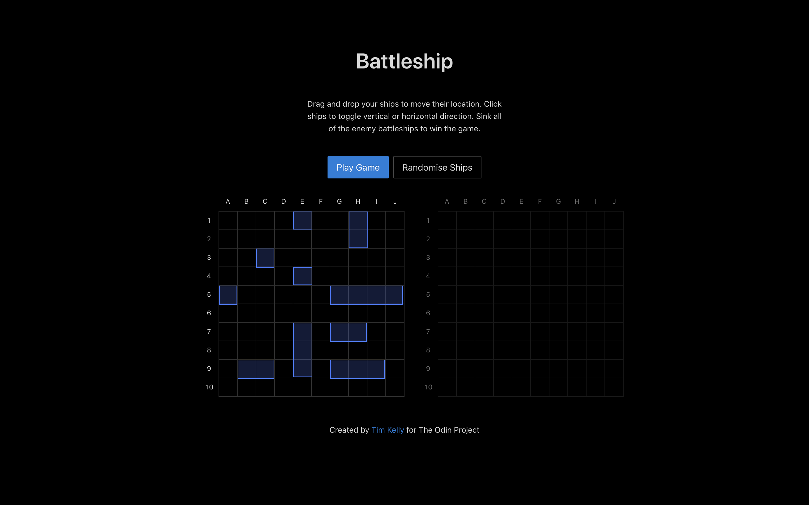
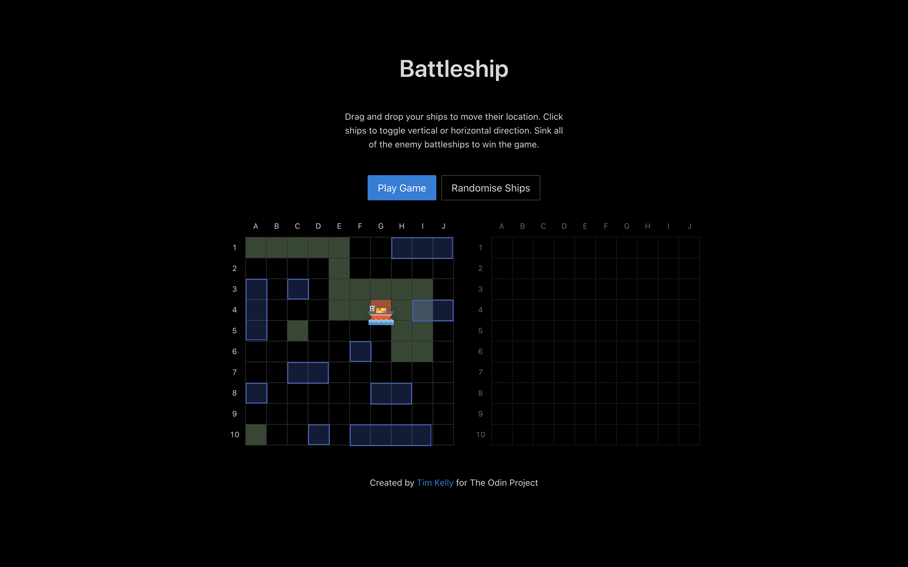
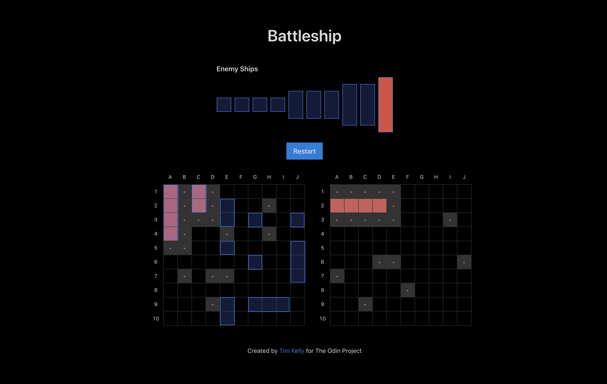

# React Battleship Game

> From The Odin Project's [curriculum](https://www.theodinproject.com/courses/javascript/lessons/battleship)

This project is a complete rebuild of the [classic battleship game](http://en.battleship-game.org/) using React, test-driven development and object-oriented programming.

## Game Features

- The project is built using test-driven development, writing unit tests in Jest
- The game logic was written in an object-oriented programming style with ship, gameboard, player and computer objects
- The game state is managed by React Hooks
- The drag and drop to move ships is built using React DnD
- The UI elements are from the Ant Design React Component library
- The gameboard, cells and ships are built using CSS and styled components

## Technologies

- React
- React Hooks
- React DnD
- Jest
- Ant Design Component Library
- Styled Components

## How To Play

To start, you place your ships on any location surrounded by empty cells. Then you attack your enemy's ships by clicking on the enemy gameboard. When the player or computer sinks all enemy ships, they are declared the winner and the game is over.

## Gameplay

